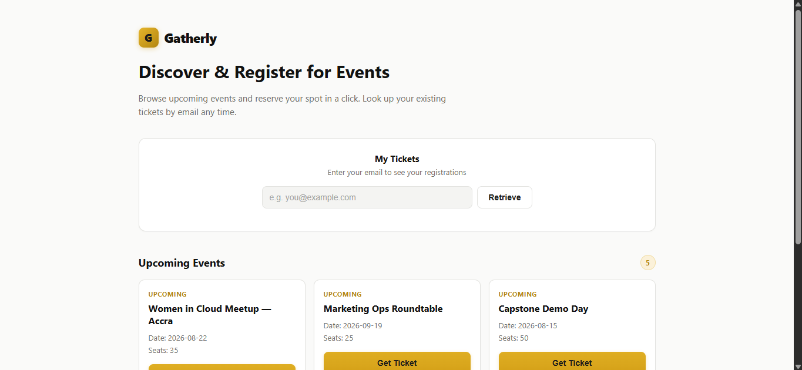
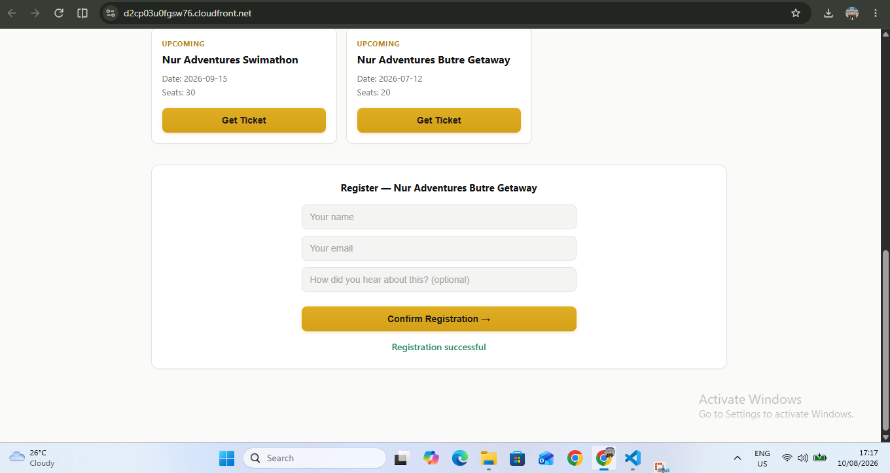
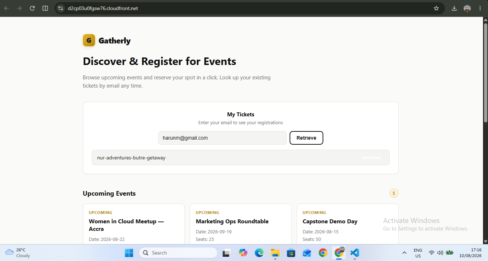
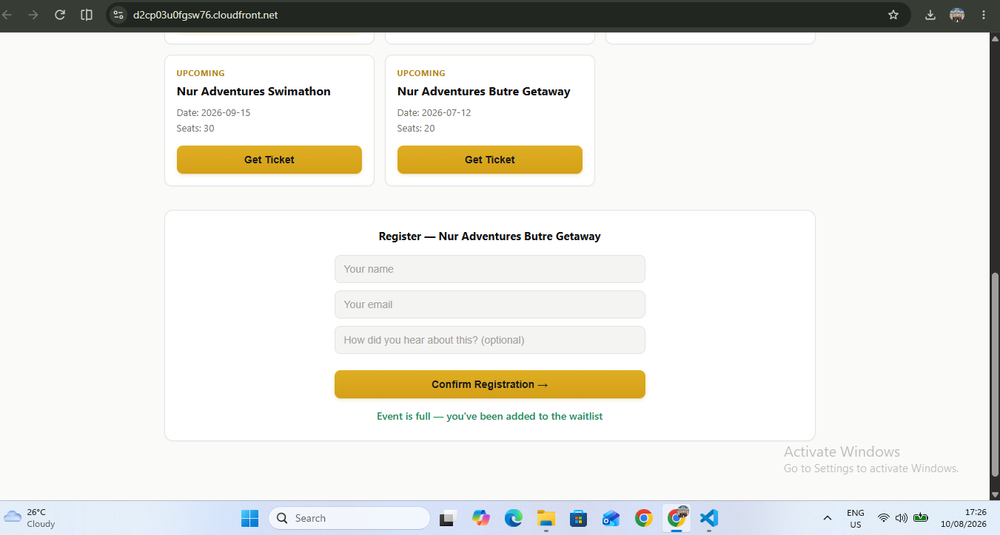
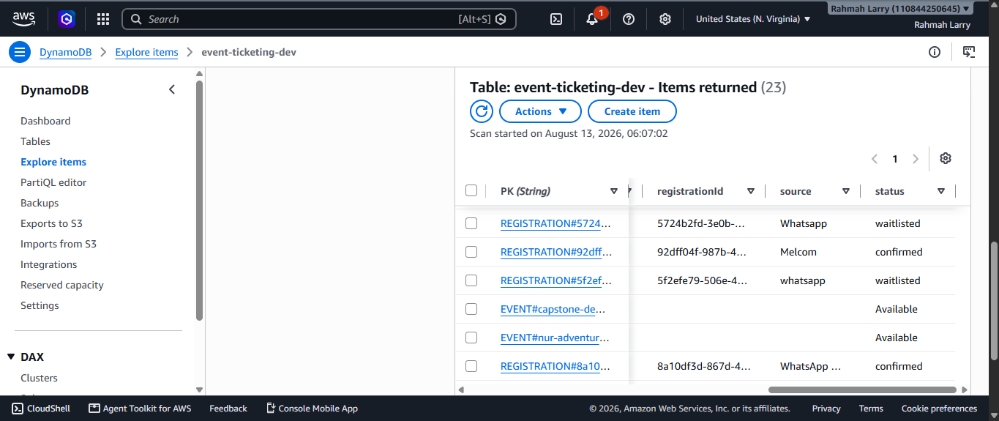
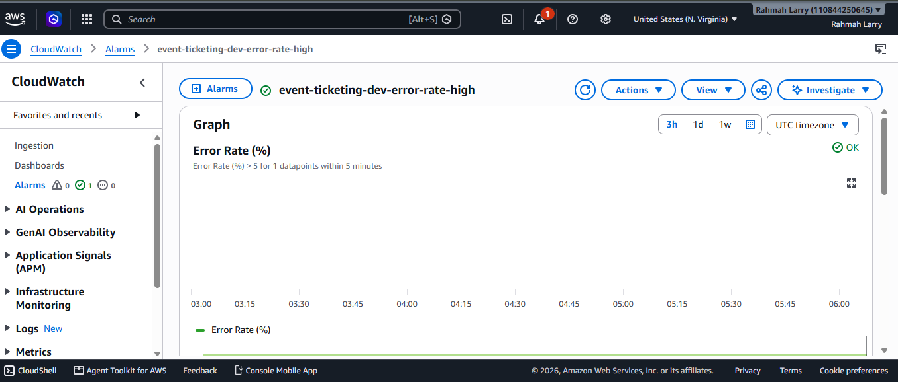
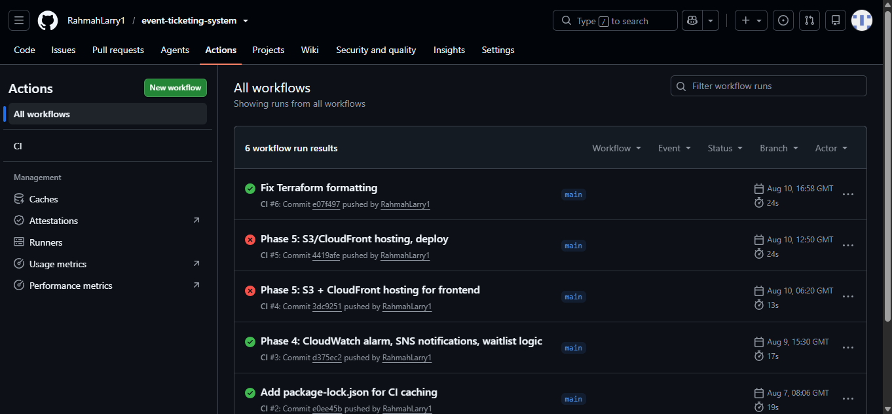

# Gatherly — Event Registration & Ticketing System

A serverless event registration and ticketing platform built on AWS, developed as a capstone project for the Azubi Africa / getINNOtized AWS Cloud Computing program. Replaces Microsoft Forms + Excel with a scalable, monitored REST API and a hosted web frontend — extended with marketing-operations features (source tracking, waitlisting, organizer notifications) as a portfolio differentiator for cloud-marketing-ops roles.

**Live site:** https://d2cp03u0fgsw76.cloudfront.net
**API base URL:** https://04wi1yylgd.execute-api.us-east-1.amazonaws.com
**Repo:** https://github.com/RahmahLarry1/event-ticketing-system

---

## Screenshots

> Replace with real screenshots before submitting — see `screenshots/` folder.

| | |
|---|---|
|  |  |
| Homepage — live events pulled from the API | Registration panel for a selected event |
|  |  |
| Looking up existing registrations by email | A registration landing on the waitlist |
|  |  |
| Raw table data — events and registrations, one table | Error-rate alarm configuration |
|  |  |
| CI pipeline passing on push | System architecture diagram |

---

## Architecture

```
                    ┌─────────────┐
                    │   Browser   │
                    └──────┬──────┘
                           │
              ┌────────────┴────────────┐
              ▼                         ▼
      ┌───────────────┐        ┌──────────────────┐
      │  CloudFront    │        │   API Gateway     │
      │  (HTTPS, CDN)  │        │   (HTTP API)      │
      └───────┬────────┘        └─────────┬─────────┘
              ▼                           ▼
      ┌───────────────┐          ┌────────────────┐
      │ S3 (private,   │          │     Lambda      │
      │ OAC-protected) │          │   handler.js    │
      │ frontend/      │          └───┬────┬────┬───┘
      │ index.html     │              │    │    │
      └───────────────┘        ┌──────┘    │    └──────┐
                                ▼           ▼           ▼
                        ┌─────────────┐ ┌──────┐ ┌─────────────┐
                        │  DynamoDB   │ │ SNS  │ │ CloudWatch  │
                        │ single table│ │topic │ │ logs+alarm  │
                        └─────────────┘ └──────┘ └─────────────┘
```

**Key architectural decisions, and why:**

| Decision | Reasoning |
|---|---|
| DynamoDB single-table design | One table holds both events (`EVENT#...`) and registrations (`REGISTRATION#...`), plus an `EmailIndex` GSI for lookup-by-email. Fewer tables to provision and pay for; standard AWS-recommended serverless pattern. |
| HTTP API, not REST API | Cheaper per request, simpler config. Both are RESTful by design; "REST API" is a specific, older AWS product name. Confirmed acceptable with course instructors. A REST-API-equivalent routing layer is kept in `terraform-restapi-alternative/` as evidence this trade-off was evaluated. |
| One Lambda for all 4 routes | API Gateway passes `event.routeKey` (e.g. `"POST /register"`); the function branches internally rather than deploying 4 separate functions. |
| Least-privilege IAM everywhere | The Lambda's role can only touch the one DynamoDB table, publish to the one SNS topic, and write CloudWatch logs — no wildcard permissions anywhere in the project. |
| Origin Access Control for the frontend | The S3 bucket is fully private; only CloudFront (scoped to this exact distribution) can read from it. |
| Manual deploy (`deploy.ps1`), CI validate-only | Auto-deploying from CI requires storing AWS credentials as GitHub Secrets — a real security surface. For a portfolio-scale project, a deliberate manual deploy step is the more defensible trade-off. |

---

## API Endpoints

| Method | Path | Description |
|---|---|---|
| `GET` | `/events` | List all events |
| `POST` | `/register` | Register for an event (or join the waitlist if full) |
| `GET` | `/registrations/{email}` | List a person's registrations |
| `DELETE` | `/registration/{id}` | Cancel a registration |

Full request/response examples, including validation and failure cases, are in [`api-test-commands.md`](./api-test-commands.md).

---

## Marketing-ops enhancements (beyond the course brief)

Built to demonstrate lifecycle-marketing thinking applied to infrastructure — not required by the brief, added deliberately:

1. **Source / UTM tracking** — every registration captures a `source` field (`"instagram"`, `"tiktok"`, `"direct"`, etc.), enabling channel-attribution analysis on signups.
2. **Waitlist logic** — a registration against a full event isn't rejected; it's saved with `status: "waitlisted"` instead of `"confirmed"` — the lead is preserved, not lost.
3. **Organizer notifications via SNS** — every registration or waitlist event triggers a notification.
   **Known, deliberate limitation:** SNS topics broadcast to a fixed subscriber list, so this notifies the event organizer, not the individual registrant. Genuine per-registrant confirmation emails would require **Amazon SES** instead. Documented here as a scope decision, not an oversight.

---

## Phase-by-phase summary

| Phase | What was built |
|---|---|
| **1 — Infrastructure Foundation** | DynamoDB table, IAM roles, Lambda, HTTP API Gateway with all 4 routes — provisioned entirely via Terraform. |
| **2 — API Development** | Real logic for all 4 endpoints: input validation, DynamoDB reads/writes/queries, correct HTTP status codes, structured error handling. |
| **3 — Automation & CI/CD** | GitHub Actions (`.github/workflows/ci.yml`) validating Lambda code (syntax + ESLint) and Terraform (`fmt -check` + `validate`) on every push/PR to `main`. |
| **4 — Monitoring & Security** | CloudWatch alarm using metric math for a real error-rate percentage (not raw counts), SNS notifications, AWS Budgets, waitlist logic, least-privilege IAM confirmed throughout. |
| **5 — Deployment & Optimization** | `deploy.ps1` automating the plan/apply workflow, S3 + CloudFront hosting via OAC, cost-conscious choices reviewed, this documentation. |

---

## Deliverables checklist

- [x] GitHub repo with API code
- [x] CI/CD pipeline (GitHub Actions)
- [x] Lambda functions
- [x] DynamoDB table definitions
- [x] CloudWatch alarms config
- [x] README file (this document)
- [x] Product presentation (deck + demo)

---

## Project structure

See [`PROJECT_STRUCTURE.md`](./PROJECT_STRUCTURE.md) for a full explanation of every folder and file in this repo and what it's responsible for.

---

## Running this project yourself

**Prerequisites:** AWS CLI configured, Terraform installed, Node.js 20+.

```powershell
git clone https://github.com/RahmahLarry1/event-ticketing-system.git
cd event-ticketing-system
```

Create `terraform/terraform.tfvars`:
```hcl
alert_email = "your-email@example.com"
```

Deploy:
```powershell
.\deploy.ps1
```

Confirm the SNS subscription email that arrives, then grab your live URLs:
```powershell
cd terraform
terraform output
```

**Tearing down:**
```powershell
terraform destroy
```

---

## Known limitations & honest trade-offs

- SNS sends organizer notifications, not per-registrant confirmation emails — SES would be the production fix.
- The capacity check has a theoretical race condition under simultaneous registrations at the exact moment an event fills — acceptable at this scale; would need a DynamoDB conditional write for production-grade correctness.
- CI validates code on every push but does not auto-deploy — deployment is a deliberate manual step, avoiding storing AWS credentials in GitHub Secrets for a portfolio-scale project.